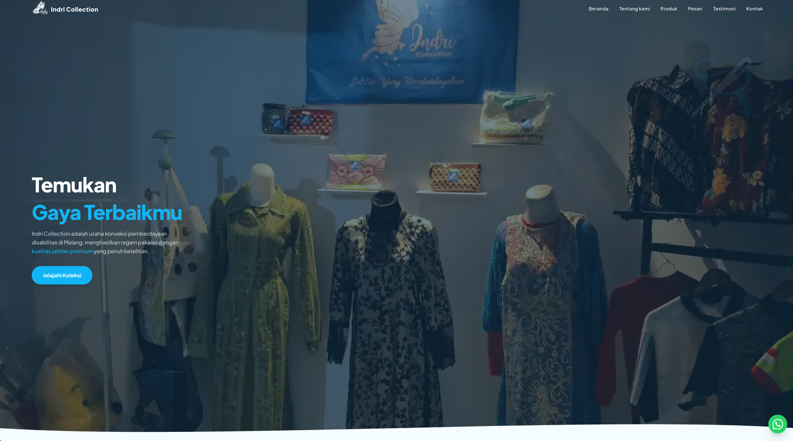

<div align="center" style="padding-bottom:40px">
  
  &nbsp;&nbsp;&nbsp;
  
</div>

  # 🧵 Indri Collection — Company Profile & Admin Panel

This website is built for **Indri Collection**, a local tailor and inclusive clothing business based in Malang, Indonesia, as part of the **Bakti Champions Movement (BCM)** initiative.
The project aims to support Indri Collection's digital transformation by establishing a stronger online presence, improving product visibility, and providing customers with a more accessible way to discover the brand and its products. Beyond serving as a digital storefront, the website also helps communicate **Indri Collection's brand story, product offerings, and commitment to empowering people with disabilities through its business activities**.
Through this platform, the project seeks to strengthen Indri Collection's brand identity, expand its digital reach, and create new opportunities for customer engagement and business growth.


## ✨ Features

### 🌐 Public Landing Page
*   **Hero Banner:** An elegant introduction showcasing professional tailoring services and brand images.
*   **Our Collection (Infinite Carousel):** An autoscrolling, interactive showcase of tailoring works with category tags and product names fetched dynamically from the database.
*   **About Us:** Shares the business's history, tailoring values, and mission.
*   **Interactive Testimonials:** Displays customer reviews to build trust.
*   **Integrated Contact Section:** Details the store's physical address, operational hours, integrated Google Maps widget, and direct links to official social media/WhatsApp chat.

### 🛡️ Admin Panel
*   **Authentication & Session Guard:** Secured using Supabase Auth with automatic login/logout redirects and session validation.
*   **Analytics Dashboard:** Visual summary of collection metrics and custom range filters.
*   **Products Management:**
    *   **Drag-and-Drop Image Uploader:** Directly drop images or click to select and upload.
    *   **Custom Naming:** Assign friendly names to products on upload.
    *   **Inline Editing:** Rename products or reassign their category directly on the product cards.
    *   **Integrated Deletion:** Safely deletes products from both Supabase Storage and PostgreSQL database.
*   **Categories Management:**
    *   **Add Category:** Instantly create new categories via custom Modal.
    *   **Manage Category Portal:** A centralized view to see all categories, rename them, or delete them along with all related products.
*   **Operational & Contact Configuration:** Customize operational hours, email address, TikTok/Instagram URL, WhatsApp hotline number, and store address dynamically.


## 🛠️ Tech Stack

*   **Framework:** [Next.js 16 (App Router)](https://nextjs.org/)
*   **Language:** [TypeScript](https://www.typescriptlang.org/)
*   **Styling:** [Tailwind CSS v4](https://tailwindcss.com/) & Vanilla CSS variables
*   **Database & Auth:** [Supabase](https://supabase.com/) (PostgreSQL + Auth Server)
*   **Storage:** Supabase Storage (for product collection image assets)
*   **ORM:** [Drizzle ORM](https://orm.drizzle.team/)
*   **UI Components:** Radix UI primitives & Lucide React Icons


## 📂 Folder Structure

```
├── public/                 # Static assets (images, logos, preview screenshots)
├── supabase/               # Supabase configuration and DB schemas
├── src/
│   ├── app/                # Next.js App Router routing
│   │   ├── api/            # Route Handler endpoints (products, categories, settings, etc.)
│   │   ├── indri-set/      # Admin Panel application (dashboard, login, products, settings)
│   │   ├── layout.tsx      # Root application layout
│   │   └── page.tsx        # Public landing page
│   ├── components/         # Reusable React components
│   │   ├── layout/         # Header, Footer, and Page wrappers
│   │   └── ui/             # Reusable UI primitives (Button, Carousel, Modal, etc.)
│   ├── constants/          # Static configurations and navigation lists
│   ├── hooks/              # Reusable React hooks
│   ├── lib/                # Shared utilities and SDK configurations (Supabase Client, utils)
│   ├── repositories/       # Data Access/Repository layer for API calls
│   ├── sections/           # Modular landing page sections
│   └── services/           # Domain/business services
```


## 🚀 Getting Started

### Prerequisites
- Node.js v18+
- npm v9+

### Installation & Run

1.  **Clone the repository**
    ```bash
    git clone https://github.com/femnixx/indri-collection-website.git
    cd indri-collection-website
    ```

2.  **Configure environment variables**
    Create a `.env` or `.env.local` file in the root directory and define the following variables:
    ```env
    NEXT_PUBLIC_SUPABASE_URL=your_supabase_url
    NEXT_PUBLIC_SUPABASE_ANON_KEY=your_supabase_anon_key
    SUPABASE_SERVICE_ROLE_KEY=your_supabase_service_role_key
    ```

3.  **Install dependencies**
    ```bash
    npm install
    ```

4.  **Run development server**
    ```bash
    npm run dev
    ```

5.  **Build for production**
    ```bash
    npm run build
    ```

---

Built with ❤️ for Indri Collection.
